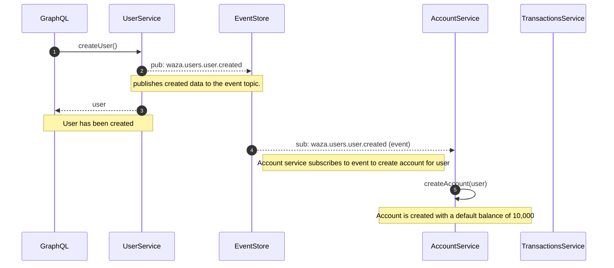

# Simple flow of how account is created asynchroniously within the system.

```mermaid

sequenceDiagram
autonumber
participant G as GraphQL
participant U as UserService
participant E as EventStore
participant A as AccountService
participant T as TransactionsService

G ->> U: createUser()
U -->> E: pub: waza.users.user.created
Note over U, E: publishes created data to the event topic.
U -->> G: user
Note over G, U: User has been created
E -->> A: sub: waza.users.user.created (event)
Note left of A: Account service subscribes to event to create account for user
A ->> A: createAccount(user)
Note over A: Account is created with a default balance of 10,000

```

